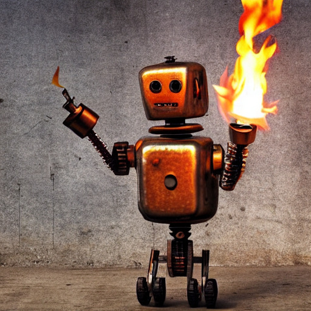

_A rusty robot holding a fire torch_, generated by stable diffusion using Rust and libtorch.

__IMPORTANT NOTE__

This example has now been moved in its own repo
[diffusers-rs](https://github.com/LaurentMazare/diffusers-rs).
The new repo includes new functionalities like inpainting, pre-packaged weights
so that it's not necessary to run the conversion steps below anymore, etc.
