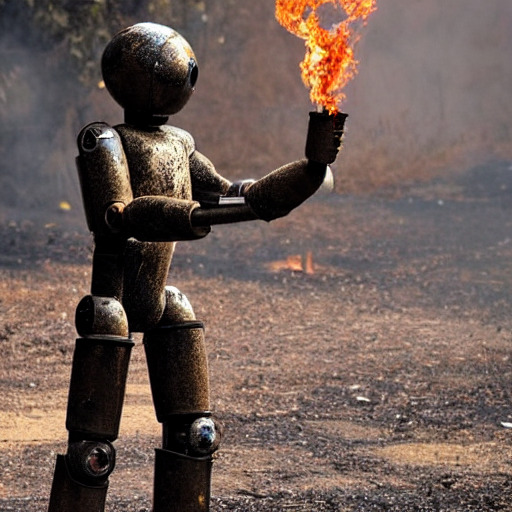
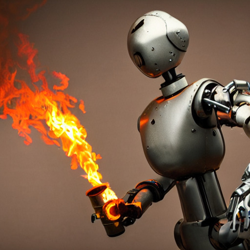

_A rusty robot holding a fire torch_, generated by stable diffusion using Rust and libtorch.

# Stable Diffusion in Rust/Torch

[Stable Diffusion](https://stability.ai/blog/stable-diffusion-public-release) is an impressive
generative model developed by [stability.ai](https://stability.ai). It can generate images
conditioned by some text prompt.

This repo contains a simple implementation of stable diffusion v1.4 using Rust and the
`tch` crate. The implementation is based on Huggingface's amazing
[diffuser](https://huggingface.co/blog/annotated-diffusion) Python library.

Other interesting resources:
- As an introduction to diffusion models, an (also amazing) [blog post from Huggingface](https://huggingface.co/blog/annotated-diffusion).
- The "Grokking Stable Diffusion" [notebook](https://colab.research.google.com/drive/1dlgggNa5Mz8sEAGU0wFCHhGLFooW_pf1?usp=sharing) by Jonathan Whitaker.

In order to run the models, one has to get the weights, see the details below and can then run
the following command. At each step, some `sd_*.png` image is generated, the last one `sd_30.png`
should be the least noisy one.

```bash
cargo run --example stable-diffusion --features regex -- "A rusty robot holding a fire torch."
```

This requires a GPU with more than 8GB of memory, as a fallback the CPU version can be used
but is slower.

```bash
cargo run --example stable-diffusion --features regex -- "A rusty robot holding a fire torch." cpu
```

The only supported scheduler is the Denoising Diffusion Implicit Model scheduler (DDIM). The
original paper and some code can be found in the [associated repo](https://github.com/ermongroup/ddim).

## Examples

A bunch of rusty robots holding some torches!






## Getting the Weights and Vocab File

In order to run this, the weights have to be downloaded, converted to the appropriate
format and copied in the top level `data` directory. There are three set of weights to
download as well as some vocabulary file for the text model.

If there is some interest in having the final weight files available, open an issue and
we could consider packaging them.

First get the vocabulary file and uncompress it.

```bash
mkdir -p data && cd data
wget https://github.com/openai/CLIP/raw/main/clip/bpe_simple_vocab_16e6.txt.gz
gunzip bpe_simple_vocab_16e6.txt.gz
```

### Clip Encoding Weights

For the clip encoding weights, start by downloading the weight file.

```bash
wget https://huggingface.co/openai/clip-vit-large-patch14/resolve/main/pytorch_model.bin
```

Then using Python, load the weights and save them in a `.npz` file.

```python
import numpy as np
import torch
model = torch.load("./pytorch_model.bin")
np.savez("./pytorch_model.npz", **{k: v.numpy() for k, v in model.items() if "text_model" in k})
```

Finally use `tensor-tools` to convert this to a `.ot` file that tch can use.

```bash
cd ..
cargo run --release --example tensor-tools cp ./data/pytorch_model.npz ./data/pytorch_model.ot
```

### VAE and Unet Weights

The weight files can be downloaded from huggingface's hub but it first requires you to log in (and to [accept the terms of use](https://huggingface.co/CompVis/stable-diffusion-v1-4) the first time). Then you can download the [VAE weights](https://huggingface.co/CompVis/stable-diffusion-v1-4/blob/main/vae/diffusion_pytorch_model.bin) and [Unet weights](https://huggingface.co/CompVis/stable-diffusion-v1-4/blob/main/unet/diffusion_pytorch_model.bin).

After downloading the files, use Python to convert them to `npz` files.

```python
import numpy as np
import torch
model = torch.load("./vae.bin")
np.savez("./vae.npz", **{k: v.numpy() for k, v in model.items()})
model = torch.load("./unet.bin")
np.savez("./unet.npz", **{k: v.numpy() for k, v in model.items()})
```

And again convert this to a `.ot` file via `tensor-tools`.

```bash
cargo run --release --example tensor-tools cp ./data/vae.npz ./data/vae.ot
cargo run --release --example tensor-tools cp ./data/unet.npz ./data/unet.ot
```
